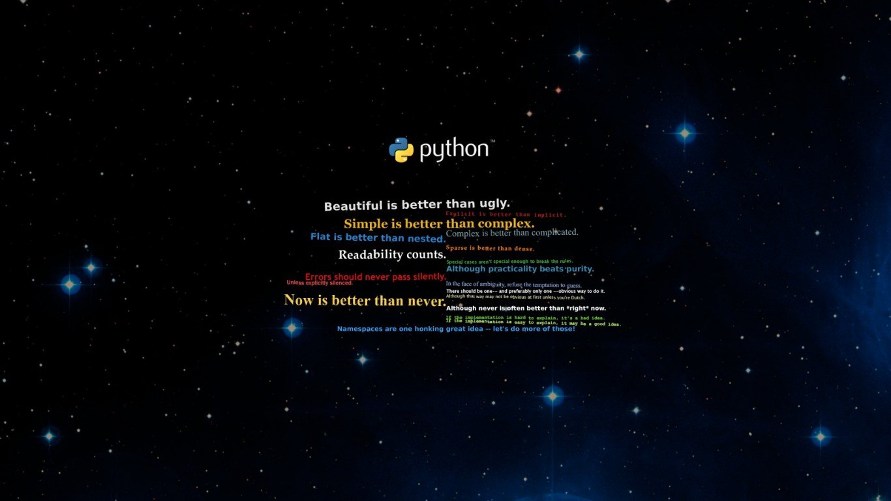

# 🌐 Proyecto de Aprendizaje en Desarrollo Web

¡Bienvenido a mi proyecto de aprendizaje en desarrollo web! 🚀 Este repositorio contiene una serie de ejercicios diseñados para aprender y practicar diversas tecnologías y conceptos relacionados con el desarrollo web. A lo largo de este proyecto, trabajaré en ejercicios que abarcan los siguientes temas:

## Tecnologías y Conceptos para Aprender 🛠️

- Python: Desarrollo de aplicaciones en el lado del servidor utilizando Python. 💻
- Bases de Datos: Trabajo con bases de datos para almacenar y recuperar información. 🗃️
- CSS: Estilización y diseño de páginas web utilizando Hojas de Estilo en Cascada. 🎨
- JavaScript: Creación de interacciones dinámicas en el navegador. 🚀
- HTML: Creación y estructuración de contenido web utilizando Lenguaje de Marcado de Hipertexto. 📝
- Django: Desarrollo de sitios web utilizando el framework web Django. 🌐
- Flask: Exploración del framework Flask para construir aplicaciones web. 🧱
- SQL: Lenguaje de Consulta Estructurado para gestionar bases de datos relacionales. 📊
- POO (Programación Orientada a Objetos): Aplicación de paradigmas de POO en el desarrollo web. 🧬
- MVC (Modelo-Vista-Controlador): Comprensión e implementación del patrón arquitectónico MVC en proyectos web. 🏗️

## Estructura del Repositorio 📂

Cada tecnología o concepto tendrá su propia carpeta con ejercicios y recursos relacionados. Dentro de cada carpeta, encontrarás:

- Ejercicios para practicar y aplicar lo aprendido.
- Archivos de ejemplo.
- Recursos útiles como enlaces a documentación y tutoriales.

Siéntete libre de explorar, clonar o bifurcar este repositorio para tus propios propósitos de aprendizaje y desarrollo.

## Contribuciones 🤝

¡Las contribuciones son bienvenidas! Puedes contribuir agregando más ejercicios, corrigiendo errores o mejorando la documentación. Tus contribuciones son muy apreciadas.

## Contacto 📬

Si tienes preguntas, sugerencias o comentarios sobre este proyecto, no dudes en contactarme:

- LinkedIn: [Javier Fullstack](https://www.linkedin.com/in/javier-fullstack/)
- Correo electrónico: ingenierodesoftware73@gmail.com

También puedes consultar mi CV [aquí](https://j4vj4r.github.io/javierjaramillo.github.io/).

¡Disfruta aprendiendo y desarrollando tus habilidades web! 🌟
